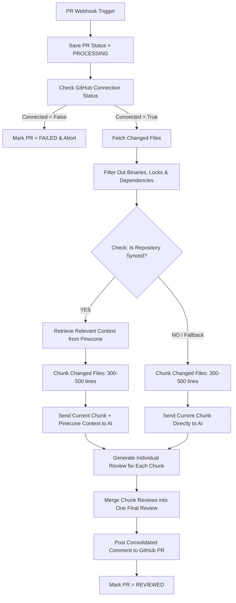

# AI Code Review Workflow & Vector-Context Integration

This document outlines the architecture, step-by-step data flow, and design decisions of the automated AI pull request (PR) review system.

---

## 1. Project Overview & Core Objective
The core objective of this system is to deliver high-signal, context-aware, and actionable code reviews directly inside GitHub Pull Requests. By combining changes from pull requests with structural repository context indexed in a vector store, the system provides senior-level code reviews that understand both the changed code and the existing code references.

---

## 2. Architecture Overview & Data Flow

The system runs asynchronously using webhook events and stateful step-by-step orchestrators. It processes code changes through five core stages:
1. **Trigger & Connection Validation**: Verifying that the GitHub integration is connected and active.
2. **File Discovery & Filtering**: Gathering changed files and filtering out noise, binaries, and lock files.
3. **Chunking & Vector Enrichment**: Breaking large code changes down and querying relevant background context.
4. **Independent AI Reviewing**: Reviewing individual code chunks with localized repository context.
5. **Consolidation & Feedback**: Merging individual findings into a final, unified review comment.

---

## 3. Core Architectural Components

### GitHub Integration & Installation Flow
- **Webhook Handlers**: Capture pull request actions (`opened`, `synchronize`, `reopened`).
- **Connection Checks**: Before starting any workflow step, the system queries the GitHub installation status using the existing connection flow. If `installation.connected` is false, the execution terminates immediately and the PR status is updated to `FAILED` to prevent wasted LLM tokens and API calls.

### Repository Sync & Pinecone Vector Context
- **Integrated Embeddings**: The system uses Pinecone as its vector database and utilizes Pinecone's integrated **`llama-text-embed-v2`** model. This removes the need for external embedding services, meaning raw text chunks can be directly stored/queried and Pinecone automatically manages the underlying vector space.
- **Context Retrieval**: If the repository is synced, a search is performed using the `llama-text-embed-v2` query vector, filtered by `repoName` metadata. This returns context snippets of related code from the repository to assist the AI in understanding downstream impacts or API patterns.
- **Fail-Safe Fallback**: If Pinecone retrieval is unavailable or fails, `isSynced` is set to `false`, and the flow falls back to direct chunk-by-chunk reviews without context. This ensures a review is still generated even during database outages.

### File Handling & Chunking Strategy
- **Universal Programming Language Support**: The system reviews all code files regardless of framework or language (similar to CodeRabbit).
- **Exclusion Filters**: Common non-reviewable files, binary files, build outputs (`node_modules`, `dist`, `.next`, `build`), lock files (`package-lock.json`, `yarn.lock`, `pnpm-lock.yaml`), and media/fonts are excluded to optimize signal-to-noise ratio.
- **300–500 Line Chunk Size**: Reviewable file patches are split into code chunks of 300–500 lines to ensure proper context density and avoid hitting token boundaries during individual reviews.

### AI Review & Consolidation Flow
- **Step 1: Chunk-Level Review**: Each chunk is analyzed independently alongside retrieved vector context (if available) using a dedicated review prompt. This localizes code smells, bugs, or performance issues.
- **Step 2: Consolidation**: A consolidation prompt is sent to the LLM along with the compiled list of chunk-level findings. The model acts as a manager, filtering duplicates, resolving conflicting findings, and prioritizing severity before producing a clean markdown review.
- **Step 3: PR Commenting**: The final consolidated review is posted back to the GitHub PR as a unified markdown comment.

---

## 4. Error Handling & Execution Design

- **Error Propagation**: The review service preserves native error propagation and leverages step-retries. If a step fails, the workflow engine automatically registers the failure.
- **Pr status**: Upon completing a successful comment post, the PR status is set to `REVIEWED`. If connection check or crucial steps fail, the status is set to `FAILED`.
- **Modular Isolation**: All Pinecone-specific operations are contained inside `lib/pinecone/**`, keeping the orchestrator logic decoupled from database implementation details.
